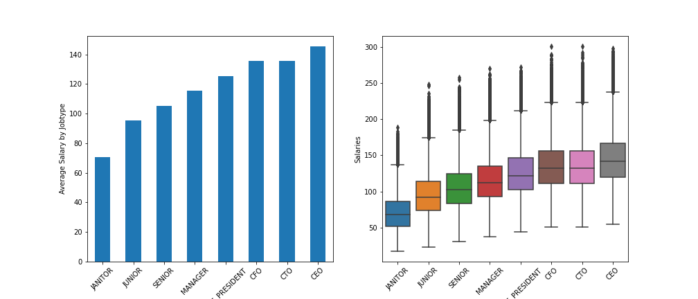
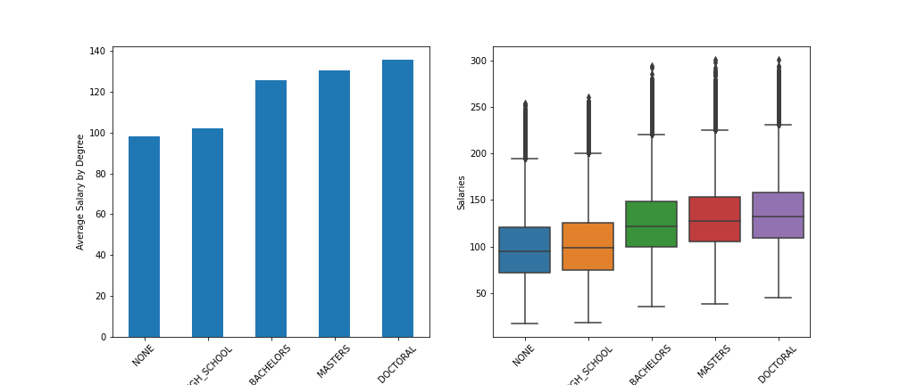
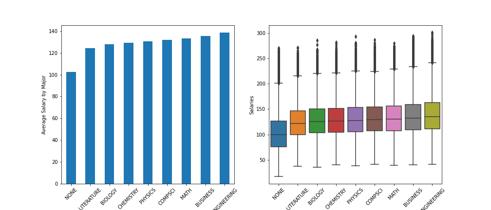
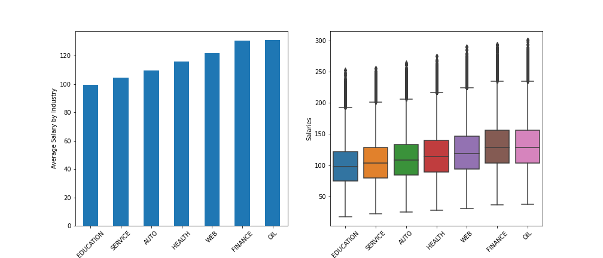
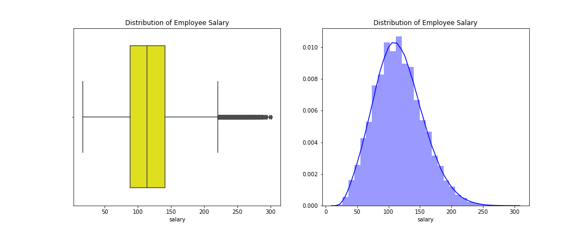
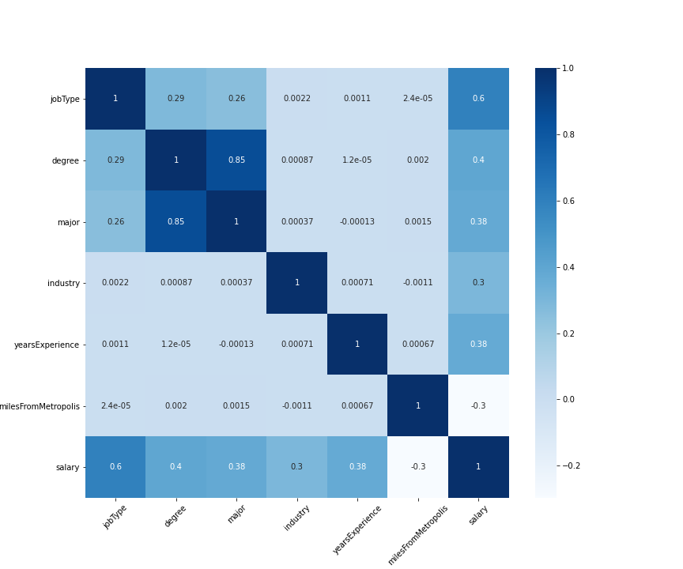
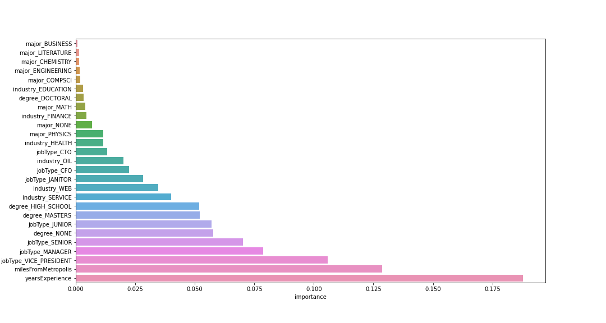

# Salary Prediction Portfolio

# What's the Problem?

This project examines job posting salaries based on existing dataset, and make prediction for salaries of new job postings. An estimation of 
salary range across different industries offers job seekers guidance in their application for their desired jobs; the HR department can use
these prediction in their construction of business processes for the job posting. 

# Datasets

train_features.csv - Each observation represents an individual's job posting; each column represents unqiue information about this applicant
and the job applied to. This dataset is meant to be used in training models.

test_features.csv - Each observation represents an individual's job posting; each column represents unqiue information about this applicant 
and the job applied to. This dataset is meant to be used for evaluating models trained on train_features.csv.

train_salaries.csv - Each observation represents an individual's salary corresponding to their job posting in train_features.csv.

Features:
* jobId - the id of the job posting (unique)
* companyId - the id of the company posting the job (unique)
* jobType - the type of the job (e.g. CEO, CFO, senior, etc)
* degree - the highest degree obtained by the applicant (e.g. DOCTORAL, MASTERS, BACHELOR, etc)
* major - the major of this applicant in college (e.g. business, math, etc)
* industry - the industry this job belongs to (e.g. oil, finance, tech, etc)
* yearsExperience - years of experience required
* milesFromMetropolis - distance away from the metropolis in miles
* salary - the salary of the job posting 

# Feature Summary 

## jobType

Higher level jobs (i.e. CEO, CFO) tend to have higher average salary. 

## degree

The higher the educational background, the higher the average salary. 

## major 

More technical majors (i.e. engineering, math) tend to have higher average salary.

## industry

Industries like oil and finance have higher average salary, which makes sense since these industries are known to pay well even at an entry 
level position.

## salary

Salary is approximately normally distributed. Basically all but a few salary are under 200k/year. 

## feature correlation

Job type, degree, major, industry, and years of experience all have positive correlation with salary. Distance from the metropolis has 
negative correlation with salary. Degree, major and job type have relatively strong positive correlation with each other.

# Training Models

Three models are selected:
1. Linear Regression
2. Random Forest
3. Grandient Boosting

The best model with lowest mean square error is the Gradient Boosting Regressor. 

# Solution 

Here's a glimpse of the predicted salaries for job postings based on the Gradient Boosting model on the training set:

## Feature Importances

Years of experience, distance from the metropolis, and job types have the most importances in predicting salary among all features. Major
type has the least importance in predicting salary. 

